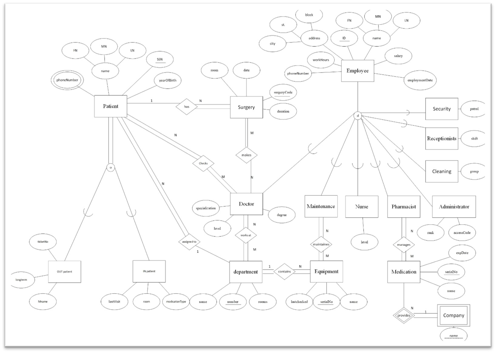

# Hospital Database Project

## Introduction

This database is designed for hospital management, covering various aspects such as patient care, staff management, and equipment maintenance. Hospitals involve complex systems with multiple actors including patients, doctors, nurses, and other staff members. This project aims to organize and manage the information related to these actors and other critical components like equipment and medications efficiently.

## Features

- **Patient Management**: Track patient information, including in-patient and out-patient details.
- **Employee Management**: Manage employee details, including doctors, nurses, administrators, and other staff.
- **Equipment and Medication Tracking**: Maintain records of equipment and medications, ensuring timely maintenance and monitoring expiration dates.
- **Departmental Organization**: Organize the hospital into various departments, each with specific responsibilities and staff.

## Important Data and Reports

### Data

- **Patients**: Details include name, SSN, year of birth, phone number, last visit, and department number. Special categories include in-patients and out-patients.
- **Surgeries**: Information about surgeries, including surgery code, patient, date, room, doctor ID, and duration.
- **Employees**: Details include name, ID, phone number, home address, date of employment, work hours, and salary. Specific roles include doctors, nurses, administrators, pharmacists, maintenance staff, cleaning staff, receptionists, and security.
- **Equipment**: Track equipment by name, serial number, department number, and last checked date.
- **Medications**: Maintain medication records including name, serial number, expiration date, and company name.
- **Departments**: Each department includes a name, number, and rooms.

### Reports

1. Full name of doctors at a specific level.
2. Names of pharmacists managing specific medications.
3. Names of patients scheduled for surgery in a specific month and year.
4. Average salary of each department.
5. Surgery codes where both doctor and patient share specific attributes.
6. Names of all patients scheduled for surgeries.
7. Names of doctors in a specific specialization.
8. Names and IDs of employees in a specific role.

## Detailed Assumptions

- Multi-valued attributes for phone numbers in patient and employee entities.
- Composite attributes for names and addresses.
- Disjoint, partial specialization for employees.
- Overlapping, total specialization for patients.
- Various relationships among entities, including patient-doctor, patient-department, doctor-surgery, and others.
- Specific ID conventions for different employee roles.

## EER Diagram

## Database Schema

The database schema includes tables for patients, employees, surgeries, equipment, medications, departments, and relationships among them.

